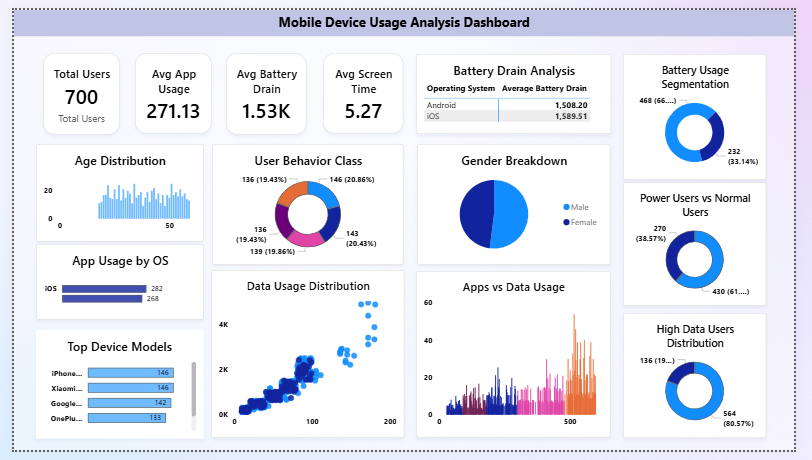
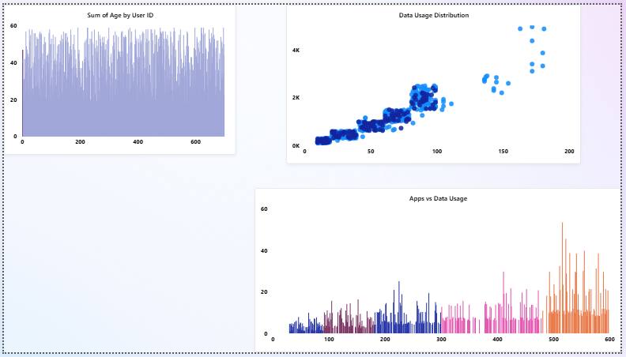

# Mobile Device Usage Analysis Dashboard

## Project Overview
This Power BI project analyzes mobile device usage patterns such as screen time, app usage, battery consumption, and user engagement behavior.

## Objective
To understand how users interact with mobile devices and identify usage trends for better insights and decision-making.

## Tools Used
- Power BI
- Excel / CSV
- Data Cleaning
- Data Visualization

## Key Features
- Screen Time Analysis
- App Usage Distribution
- Battery Consumption Insights
- User Behavior Patterns
- Interactive Filters & Slicers

## Key Insights
- Most used apps by category
- Peak usage time of users
- Battery drain vs screen time correlation
- High engagement usage patterns

## Dashboard Preview

### Overview Dashboard

### App Usage Analysis

## Skills Demonstrated
- Data Cleaning
- Data Analysis
- Dashboard Building
- Insight Generation

## Author
Apurva Amborkar  
Aspiring Data Analyst  
